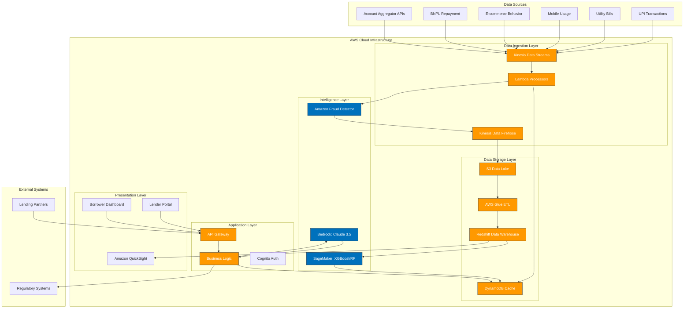

# Design Document: VISTAAR Trust Score Engine

## Overview

The VISTAAR Trust Score Engine is a cloud-native, AI-powered alternative credit scoring system designed to serve India's 160 million credit invisible population. The system leverages AWS services including Amazon Bedrock (Claude 3.5 Sonnet), Amazon Kinesis for real-time data ingestion, and Amazon Redshift for data warehousing to transform digital behavior patterns into reliable credit scores.

The architecture follows a microservices pattern with event-driven processing, ensuring scalability, reliability, and compliance with Indian financial regulations including RBI guidelines and data localization requirements.

## Architecture

### High-Level Architecture



### Component Architecture

The system is organized into distinct layers following cloud-native principles:

1. **Data Ingestion Layer**: Real-time streaming using Amazon Kinesis
2. **Data Storage Layer**: Add AWS Glue as the service used for ETL and Data Cataloging between S3 and Redshift.
3. **AI/ML Layer**:Add Amazon Fraud Detector for real-time fraud detection (synthetic identity/anomaly) and note that SageMaker specifically hosts XGBoost/Random Forest models.
4. **Application Layer**: Serverless business logic with Lambda functions
5. **Frontend Layer**: Add Amazon QuickSight as the primary engine for the Lender Dashboard's visual analytics and reports.

## Components and Interfaces

### Data Ingestion Service

**Purpose**: Real-time ingestion and initial processing of digital behavior data

**Key Components**:
- **Kinesis Data Streams**: Primary ingestion point for all data sources
- **Lambda Stream Processors**: Real-time data validation, transformation, and enrichment
- **Kinesis Data Firehose**: Batch delivery to data warehouse and data lake

**Interfaces**:
```typescript
interface DataIngestionService {
  ingestUPITransaction(transaction: UPITransaction): Promise<IngestionResult>
  ingestUtilityBill(bill: UtilityBill): Promise<IngestionResult>
  ingestMobileUsage(usage: MobileUsage): Promise<IngestionResult>
  validateDataFormat(data: RawData): ValidationResult
  enrichData(data: ValidatedData): EnrichedData
}

interface UPITransaction {
  userId: string
  amount: number
  timestamp: Date
  merchantCategory: string
  transactionType: 'debit' | 'credit'
  frequency: number
}

interface UtilityBill {
  userId: string
  billType: 'electricity' | 'water' | 'gas' | 'telecom'
  amount: number
  dueDate: Date
  paymentDate: Date
  paymentStatus: 'on-time' | 'late' | 'missed'
}
```

**Processing Pipeline**:
1. Data arrives at Kinesis Data Streams (up to 10,000 records/second)
2. Lambda processors validate format and extract features
3. Enrichment adds derived metrics (payment velocity, spending patterns)
4. Clean data flows to both real-time cache (DynamoDB) and batch storage (Redshift)

### AI-Powered Scoring Engine

**Purpose**: Generate trust scores using advanced AI/ML models

**Key Components**:
- **Amazon Bedrock Integration**: Claude 3.5 Sonnet for complex pattern analysis
- **Feature Engineering Pipeline**: Transform raw data into ML-ready features
- **Ensemble Scoring Models**: Multiple models for robust predictions
- **Real-time Inference**: Sub-second scoring capabilities

**Interfaces**:
```typescript
interface ScoringEngine {
  generateTrustScore(userId: string): Promise<TrustScoreResult>
  batchScore(userIds: string[]): Promise<TrustScoreResult[]>
  updateScore(userId: string, newData: DigitalBehaviorData): Promise<TrustScoreResult>
  getScoreHistory(userId: string, timeRange: TimeRange): Promise<ScoreHistory[]>
}

interface TrustScoreResult {
  userId: string
  score: number // 300-850 range
  confidence: number // 0-1 range
  factors: ScoringFactor[]
  timestamp: Date
  modelVersion: string
}

interface ScoringFactor {
  category: string
  impact: number // -100 to +100
  description: string
  weight: number
}
```

**AI/ML Architecture**:
- **Primary Model**: Amazon SageMaker utilizing XGBoost/Random Forest algorithms for high-performance, real-time credit score generation.
- **Intelligence & Explainability**: Amazon Bedrock (Claude 3.5 Sonnet) for deep behavioral pattern analysis and generating natural language score explanations in Hindi and English.
- **Fraud Guardian**: Amazon Fraud Detector integrated for real-time identification of synthetic identities ("Ghost Profiles") and transaction anomalies.
- **Ensemble Approach**: Combines traditional ML scoring (SageMaker) with AI-driven behavioral insights (Bedrock) for a robust Trust Score.
- **Model Monitoring**: Continuous performance tracking, drift detection, and bias monitoring across demographic groups.

### Explainability Engine

**Purpose**: Provide transparent, understandable explanations for trust scores

**Key Components**:
- **SHAP Integration**: Model-agnostic explanations
- **Natural Language Generation**: Claude-powered plain language explanations
- **Recommendation Engine**: Actionable improvement suggestions
- **Multi-language Support**: Hindi and English explanations

**Interfaces**:
```typescript
interface ExplainabilityEngine {
  explainScore(scoreResult: TrustScoreResult): Promise<ScoreExplanation>
  generateRecommendations(userId: string): Promise<ImprovementRecommendation[]>
  getFactorTrends(userId: string, factor: string): Promise<FactorTrend[]>
  translateExplanation(explanation: ScoreExplanation, language: 'hi' | 'en'): Promise<ScoreExplanation>
}

interface ScoreExplanation {
  primaryFactors: ExplanationFactor[]
  positiveInfluences: string[]
  negativeInfluences: string[]
  plainLanguageExplanation: string
  technicalDetails: TechnicalExplanation
}

interface ImprovementRecommendation {
  category: string
  action: string
  expectedImpact: number
  timeframe: string
  difficulty: 'easy' | 'medium' | 'hard'
}
```

### Real-time API Gateway

**Purpose**: Provide high-performance API access for scoring and data retrieval

**Key Components**:
- **AWS API Gateway**: Managed API endpoint with throttling and caching
- **Lambda Authorizers**: JWT-based authentication and authorization
- **Response Caching**: DynamoDB-backed caching for frequently accessed scores
- **Rate Limiting**: Configurable limits per client

**Interfaces**:
```typescript
interface TrustScoreAPI {
  // Real-time scoring
  GET /api/v1/score/{userId}: Promise<TrustScoreResult>
  POST /api/v1/score/batch: Promise<TrustScoreResult[]>
  
  // Score history and trends
  GET /api/v1/score/{userId}/history: Promise<ScoreHistory[]>
  GET /api/v1/score/{userId}/explanation: Promise<ScoreExplanation>
  
  // Data management
  POST /api/v1/data/ingest: Promise<IngestionResult>
  DELETE /api/v1/data/{userId}: Promise<DeletionResult>
  
  // Health and monitoring
  GET /api/v1/health: Promise<HealthStatus>
  GET /api/v1/metrics: Promise<SystemMetrics>
}
```

**Performance Specifications**:
- **Response Time**: <500ms for single score requests
- **Throughput**: 1000+ requests per second
- **Availability**: 99.9% uptime SLA
- **Caching**: 95% cache hit rate for frequently accessed scores

## Data Models

### Core Data Structures

**User Profile**:
```typescript
interface UserProfile {
  userId: string
  demographics: {
    ageRange: string
    location: {
      state: string
      city: string
      pincode: string
    }
    occupation: string
    incomeRange?: string
  }
  digitalFootprint: {
    upiTransactions: UPITransaction[]
    utilityPayments: UtilityBill[]
    mobileUsage: MobileUsage[]
    ecommerceActivity: EcommerceActivity[]
    bnplHistory: BNPLTransaction[]
  }
  consentManagement: {
    dataUsageConsent: boolean
    consentTimestamp: Date
    consentVersion: string
    dataRetentionPeriod: number
  }
}
```

**Feature Vector**:
```typescript
interface FeatureVector {
  userId: string
  timestamp: Date
  features: {
    // Payment behavior features
    avgMonthlyUPIVolume: number
    paymentRegularity: number
    utilityPaymentTimeliness: number
    
    // Spending pattern features
    merchantDiversity: number
    spendingStability: number
    cashFlowPattern: number
    
    // Digital engagement features
    mobileUsageConsistency: number
    digitalServiceAdoption: number
    
    // Risk indicators
    latePaymentFrequency: number
    overdraftIndicators: number
    financialStressSignals: number
  }
  modelVersion: string
}
```

**Trust Score Record**:
```typescript
interface TrustScoreRecord {
  userId: string
  score: number
  confidence: number
  timestamp: Date
  modelVersion: string
  featureVector: FeatureVector
  explanationFactors: ScoringFactor[]
  complianceMetadata: {
    dataSourceConsents: string[]
    regulatoryVersion: string
    auditTrail: AuditEntry[]
  }
}
```

### Data Storage Strategy

**Amazon Redshift (Data Warehouse)**:
- **Historical Data**: Long-term storage of all user interactions and scores
- **Analytics Workloads**: Complex queries for model training and business intelligence
- **Data Retention**: 7 years for regulatory compliance
- **Partitioning**: By date and user_id for optimal query performance

**DynamoDB (Real-time Cache)**:
- **Current Scores**: Latest trust scores for sub-second retrieval
- **User Sessions**: Active user state and preferences
- **API Rate Limiting**: Request throttling and quota management
- **TTL**: Automatic cleanup of expired cache entries

**S3 Data Lake**:
- **Raw Data Archive**: Immutable storage of all ingested data
- **Model Artifacts**: Trained models and feature engineering pipelines
- **Compliance Exports**: Regulatory reporting and audit trails
- **Lifecycle Policies**: Automatic archival to Glacier for cost optimization

## Correctness Properties

*A property is a characteristic or behavior that should hold true across all valid executions of a system—essentially, a formal statement about what the system should do. Properties serve as the bridge between human-readable specifications and machine-verifiable correctness guarantees.*

Based on the prework analysis of acceptance criteria, the following properties ensure system correctness:

### Data Processing Properties

**Property 1: Data ingestion processing and validation**
*For any* digital behavior data (UPI transactions, utility bills, mobile usage), when ingested by the Data_Ingestion_Service, the data should be validated, processed within acceptable time limits, and stored with appropriate anonymization while preserving behavioral patterns.
**Validates: Requirements 1.1, 1.2, 1.3**

**Property 2: Error handling resilience**
*For any* batch of data containing both valid and invalid records, the system should log errors for invalid data, continue processing valid records, and maintain system stability.
**Validates: Requirements 1.5, 3.3, 3.5**

**Property 3: Multi-source concurrent processing**
*For any* combination of up to 5 different data source types, the Data_Ingestion_Service should successfully process them simultaneously without data corruption or processing failures.
**Validates: Requirements 1.6**

### Scoring Algorithm Properties

**Property 4: Trust score generation bounds and timing**
*For any* user profile with sufficient data, the Scoring_Algorithm should generate a trust score between 300-850 within the specified time limits and provide confidence intervals for insufficient data cases.
**Validates: Requirements 2.1, 2.2**

**Property 5: Data source weighting and score updates**
*For any* user with multiple data sources, the scoring algorithm should weight them appropriately by predictive value and recency, and automatically update scores when new data becomes available.
**Validates: Requirements 2.3, 2.4**

**Property 6: Demographic fairness**
*For any* diverse population across age, gender, and geographic regions, the scoring algorithm should produce fair score distributions without systematic bias against any demographic group.
**Validates: Requirements 2.5**

### API and Performance Properties

**Property 7: API response performance**
*For any* valid API request, the Trust_Score_Engine should return responses within specified time limits and handle batch requests up to the maximum supported size.
**Validates: Requirements 3.1, 3.4**

**Property 8: Rate limiting and authentication**
*For any* client making API requests, the system should enforce configurable rate limits and properly authenticate requests, rejecting invalid authentication with appropriate logging.
**Validates: Requirements 3.6, 3.5**

**Property 9: Database query performance**
*For any* database query executed by the system, 95% should complete within 100 milliseconds to maintain system responsiveness.
**Validates: Requirements 7.5**

### Explainability Properties

**Property 10: Score explanation completeness**
*For any* generated trust score, the Explainability_Engine should provide exactly 5 top influencing factors and identify behavioral changes that caused score modifications.
**Validates: Requirements 4.1, 4.3**

**Property 11: Recommendation generation and consistency**
*For any* user profile, the system should provide actionable improvement recommendations, and similar profiles should receive consistent explanations across multiple requests.
**Validates: Requirements 4.4, 4.5**

**Property 12: Multi-language explanation support**
*For any* score explanation request, the system should provide explanations in both Hindi and English languages with equivalent content quality.
**Validates: Requirements 4.6**

### Security and Compliance Properties

**Property 13: Data security and encryption**
*For any* personal data stored or transmitted by the system, it should be encrypted using AES-256 at rest and TLS 1.3 in transit, with role-based access controls and comprehensive access logging.
**Validates: Requirements 5.1, 5.2, 5.4, 5.5**

**Property 14: Data deletion and privacy**
*For any* user data deletion request, the system should remove all personal data within 30 days while preserving anonymized behavioral patterns for model training.
**Validates: Requirements 5.3**

**Property 15: Regulatory compliance and audit trails**
*For any* credit scoring operation, the system should ensure RBI guideline compliance, maintain audit trails, implement consent management, and support compliance report generation.
**Validates: Requirements 6.1, 6.3, 6.4, 6.6**

**Property 16: Data localization compliance**
*For any* financial data stored by the system, it should be stored in locations compliant with Indian data protection laws and localization requirements.
**Validates: Requirements 6.2**

### Portal and Dashboard Properties

**Property 17: Lender portal functionality**
*For any* lender accessing the portal, the system should authenticate users, provide dashboard functionality, support profile searches with performance requirements, and enable bulk processing capabilities.
**Validates: Requirements 8.1, 8.2, 8.4**

**Property 18: Score review and integration**
*For any* trust score review in the lender portal, detailed explanations should be provided in structured format, and the system should support integration with external loan management systems.
**Validates: Requirements 8.3, 8.6**

**Property 19: Borrower dashboard functionality**
*For any* borrower accessing their dashboard, the system should display current scores with visual representation, show historical trends with explanations, and provide personalized improvement recommendations.
**Validates: Requirements 9.1, 9.2, 9.3**

**Property 20: Notification and consent management**
*For any* significant score change (>25 points), the system should send notifications, and for any new data source connection, it should guide users through secure consent processes.
**Validates: Requirements 9.4, 9.5**

**Property 21: Educational content provision**
*For any* borrower using the dashboard, educational content about credit building and financial literacy should be available and accessible.
**Validates: Requirements 9.6**

### Model Governance Properties

**Property 22: Model monitoring and alerting**
*For any* model prediction made by the system, accuracy and drift metrics should be tracked in real-time, with alerts triggered when performance degrades below acceptable thresholds.
**Validates: Requirements 10.1, 10.2**

**Property 23: Model versioning and testing**
*For any* model deployment, the system should maintain version control with rollback capabilities and support A/B testing of new model versions before full deployment.
**Validates: Requirements 10.4, 10.5**

**Property 24: Bias monitoring and decision logging**
*For any* model analysis period, bias reports should be generated across demographic groups, and all model decisions should be logged with input features for audit purposes.
**Validates: Requirements 10.3, 10.6**

<function_calls>
<invoke name="prework">
<parameter name="featureName">vistaar-trust-score

## Error Handling

### Error Classification and Response Strategy

**Data Ingestion Errors**:
- **Format Validation Errors**: Invalid JSON, missing required fields, incorrect data types
  - Response: Log error, return structured error response, continue processing other records
  - Recovery: Provide data format guidelines to data providers

- **Business Logic Errors**: Invalid UPI amounts, future-dated transactions, impossible values
  - Response: Flag for manual review, apply default values where appropriate
  - Recovery: Implement data quality rules and automated corrections

- **System Errors**: Database connection failures, service timeouts, memory issues
  - Response: Implement circuit breakers, retry with exponential backoff
  - Recovery: Automatic failover to backup systems, alert operations team

**Scoring Engine Errors**:
- **Insufficient Data Errors**: Users with less than 3 months of data
  - Response: Generate preliminary score with confidence intervals, flag as "limited data"
  - Recovery: Encourage users to connect additional data sources

- **Model Inference Errors**: Model unavailable, feature extraction failures
  - Response: Fall back to previous model version or simplified scoring algorithm
  - Recovery: Automatic model health checks and rollback procedures

- **Bias Detection Errors**: Unfair score distributions detected
  - Response: Trigger immediate model review, implement bias correction
  - Recovery: Retrain models with fairness constraints

**API and Integration Errors**:
- **Authentication Errors**: Invalid tokens, expired credentials
  - Response: Return 401 Unauthorized with clear error message
  - Recovery: Provide token refresh mechanisms

- **Rate Limiting Errors**: Exceeded request quotas
  - Response: Return 429 Too Many Requests with retry-after header
  - Recovery: Implement client-side rate limiting and request queuing

- **Downstream Service Errors**: External API failures, database unavailability
  - Response: Implement graceful degradation, serve cached responses when possible
  - Recovery: Health checks and automatic service discovery

### Error Monitoring and Alerting

**Real-time Monitoring**:
- CloudWatch dashboards for error rates, response times, and system health
- Custom metrics for business-specific errors (scoring failures, bias detection)
- Automated alerts for critical errors with escalation procedures

**Error Recovery Procedures**:
- Automated retry mechanisms with exponential backoff
- Circuit breaker patterns to prevent cascade failures
- Graceful degradation to maintain core functionality during outages

## Testing Strategy

### Dual Testing Approach

The VISTAAR Trust Score engine requires comprehensive testing using both unit tests and property-based tests to ensure correctness, performance, and regulatory compliance.

**Unit Testing Focus**:
- **Specific Examples**: Test concrete scenarios like processing a valid UPI transaction
- **Edge Cases**: Handle boundary conditions such as minimum/maximum score values (300/850)
- **Error Conditions**: Verify proper handling of invalid data formats and authentication failures
- **Integration Points**: Test API endpoints, database connections, and external service integrations
- **Regulatory Compliance**: Verify specific RBI guideline implementations and data localization

**Property-Based Testing Focus**:
- **Universal Properties**: Verify properties hold across all possible inputs using randomized test data
- **Comprehensive Coverage**: Generate thousands of test cases automatically to catch edge cases
- **Model Correctness**: Validate scoring algorithms across diverse user profiles and data combinations
- **Performance Properties**: Ensure response time and throughput requirements under various loads
- **Security Properties**: Verify encryption, authentication, and access control across all scenarios

### Property-Based Testing Configuration

**Testing Framework**: Use Hypothesis (Python) or fast-check (TypeScript) for property-based testing
**Test Iterations**: Minimum 100 iterations per property test to ensure statistical significance
**Test Data Generation**: 
- Generate realistic user profiles with varying demographics and digital behavior patterns
- Create synthetic UPI transactions, utility bills, and mobile usage data
- Simulate various error conditions and edge cases

**Property Test Tagging**:
Each property-based test must reference its corresponding design document property:
- **Feature: vistaar-trust-score, Property 1**: Data ingestion processing and validation
- **Feature: vistaar-trust-score, Property 4**: Trust score generation bounds and timing
- **Feature: vistaar-trust-score, Property 13**: Data security and encryption

### Testing Environments

**Development Testing**:
- Local testing with Docker containers for AWS services (LocalStack)
- Synthetic data generation for privacy-compliant testing
- Fast feedback loops for developers

**Staging Testing**:
- Full AWS environment with production-like data volumes
- End-to-end testing of all integrations
- Performance testing under realistic loads
- Security penetration testing

**Production Testing**:
- Canary deployments with gradual traffic increase
- A/B testing for model improvements
- Continuous monitoring and automated rollback triggers
- Compliance validation with real regulatory scenarios

### Compliance Testing

**Regulatory Compliance Validation**:
- Automated tests for RBI guideline adherence
- Data localization verification for all stored data
- Consent management workflow testing
- Audit trail completeness validation

**Privacy and Security Testing**:
- Data anonymization verification
- Encryption validation for data at rest and in transit
- Access control testing across all user roles
- Data deletion compliance testing (30-day requirement)

**Fairness and Bias Testing**:
- Demographic fairness validation across age, gender, and geography
- Score distribution analysis for bias detection
- Explanation consistency testing for similar user profiles
- Model performance monitoring across different population segments

This comprehensive testing strategy ensures the VISTAAR Trust Score engine meets all functional requirements while maintaining the highest standards of security, compliance, and fairness required for serving India's credit invisible population.